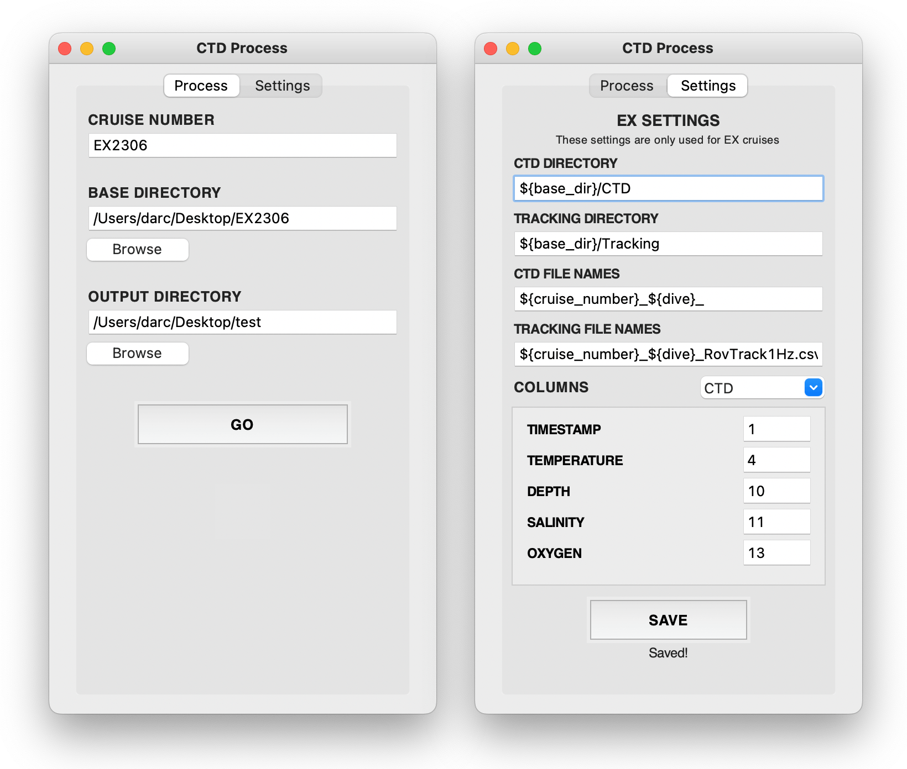

# Overview 

This repository contains scripts that prepare ROV sensor data for input into VARS. There are currently two scripts, one for data from Deep Discoverer (Nautilus, NA) and one for data from Hercules, (Okeanos Explorer, EX). The scripts can be run from the command line or through a simple GUI (recommended).

### Requirements

- Python ≥ 3.10
- R and R packages `tidyverse`, `jsonlite`, `readr`, `dplyr`, `purrr`, and `cli`
- Command line tools `ag` and `jq` (install with `brew install ag jq`)

## GUI

To use the GUI, navigate to the root of the repository and run the command `python3 gui.py`.

<p align="center">
    
</p>

The GUI two tabs, `Process` and `Settings`. On the `Process` tab, there are three inputs: cruise number, base directory, and output directory. The cruise number is the cruise number of the cruise to be processed, e.g. `NA138` or `EX2306`. The base directory is the path to the directory containing the cruise directory, e.g. `/Volumes/maxarray2/varsadditional/OER2023/EX2306`. The output directory is the path to the directory where the processed data will be saved, e.g. `/Users/darc/Desktop/test`.

The `Settings` tab allows the user to change the settings for EX cruises. 
- The program expects all CTD files to be located directly inside the directory that is entered in the `CTD DIRECTORY` input field (it does not search subdirectories). In the screenshot above, the base directory is taken from the entry in the `Process` tab as the variable `${base_dir}`. This example would result in `/Users/darc/Desktop/EX2306/CTD`. 
- Tracking files follow the same logic as CTD files.
- CTD/Tracking file name inputs are the template string that the program will search for to match file names. In the screenshot above, the program will match any file that contains `EX2306_${dive}` (where dive name is determined later by the program) and interpret it as a CTD file. In this example, tracking files are matched with more specificity: `EX2306_${dive}_RovTrack1Hz.csv`.
- CTD/Tracking column numbers can be specified in the bottom section. These are the column numbers that the program will use to extract data from the files. Columns indices are 1-based, so the first column is column 1.
- Selecting `SAVE` will save the settings to a local JSON file. This file will be loaded automatically the next time the GUI is opened.

_Note_: Currently, only EX cruise settings are able to be modified. For Nautilus cruises, it is assumed that the directory structure is static and will not change.

## Nautilus

The script to process data from the Nautilus is called `na_ctd_processor.sh`. This is a bash script that takes a cruise number, a source path, a `dive_reports` path, and a destination path as arguments:

```bash
./na_ctd_processor.sh <cruise_number> <cruise_source_path> <dive_reports_source> <output_destination_path>
```

The `cruise_source_path` is the path to the cruise directory on the server. The `dive_reports_source` is the path to the `dive_reports` directory on the server (defined separately in case the location of the `dive_reports` folder changes in the future). The `output_destination_path` is the path to the directory where the processed data will be saved.

The script starts by finding a list of all the dives in the cruise. For each dive, it copies the relevant data files to a temporary directory at the output destination path. These include `.CTD.NAV.tsv` files (lat/long, depth, temperature, and salinity) and `.O2S.NAV.tsv` files (oxygen).

Next, the script calls `extract_DAT.sh` to extract altitude data and timestamps from the `.DAT` files. This script finds the `.DAT` files in the source directory that coincide with the start and end times of the dive, extracts the altitude/timestamps from these files, and saves a merged `.DAT` file for the dive in the temporary directory.

The script then calls `NA.R` to merge the three file types into a single formatted `.tsv` file that is saved in the output destination path. This file is then ready to be uploaded to VARS.

Finally, the script deletes the temporary directory.

## Okeanos Explorer

The script to process data from the Okeanos Explorer is called `ex_ctd_processor.sh`. This script is slightly different from the NA script because it is more flexible and requires more user input. The only argument here is the path to the JSON config file, which contains all the information necessary for the script to run:

```bash
./ex_ctd_processor.sh <config_file_path>
```

Similar to the NA script, the script starts by finding a list of all the dives in the cruise. For each dive, it copies the relevant data files to a temporary directory at the output destination path. For NA, these include `ROVCTD_DERIVE.cnv` files (depth, temperature, oxygen, and salinity) and `RovTrack1Hz.csv` files (lat/long and altitude).

The script then calls `EX.R` to merge the two files into a single formatted `.tsv` file that is saved in the output destination path. This file is then ready to be uploaded to VARS.

Finally, the script deletes the temporary directory.

## Notes

- The scripts are currently set up to run on a Mac. They may need to be modified to run on a PC.
- EX `ROVCTD_DERIVE.cnv` files currently use an interesting timestamp: the first column is the number of seconds since 2000-01-01 00:00:00Z. This is converted to a standard timestamp in the R script.
- If the folder structure, file names, or columns in the NA files change, the NA script will need to be updated accordingly.

### NA Expected Values

#### Folder structure

```bash
.
└── ${CRUISE_NUMBER}/
    ├── processed/
    │   └── dive_reports/
    │       ├── ${DIVE_NUMBER_1}/
    │       │   └── merged/
    │       │       ├── ${DIVE_NUMBER_1}.CTD.NAV.tsv
    │       │       ├── ${DIVE_NUMBER_1}.O2S.NAV.tsv
    │       │       └── ...
    │       ├── ${DIVE_NUMBER_2}/
    │       │   └── merged/
    │       │       ├── ${DIVE_NUMBER_2}.CTD.NAV.tsv
    │       │       ├── ${DIVE_NUMBER_2}.O2S.NAV.tsv
    │       │       └── ...
    │       └── ...
    └── raw/
        └── nav/
            └── navest/
                ├── YYYYMMDD_HHMM.DAT
                ├── YYYYMMDD_HHMM.DAT
                ├── YYYYMMDD_HHMM.DAT
                └── ...
```

#### File names

**CTD Files (Lat, Long, Depth, Temperature, Salinity)**

Format: `${DIVE_NUMBER}.CTD.NAV.tsv` 

Example: `H1915.CTD.NAV.tsv`

**O2 Files (Oxygen)**

Format: `${DIVE_NUMBER}.O2S.NAV.tsv`

Example: `H1915.O2S.NAV.tsv`

**DAT Files (Altitude)**

Format: `YYYYMMDD_HHMM.DAT`

Example: `20220407_0600.DAT`

#### Column order
`X` indicates a column that is not used.

**CTD.NAV.tsv**
```
Timestamp, Latitude, Longitude, Depth, Temperature, X1, X2, Salinity, X3
```

**O2S.NAV.tsv**
```
Timestamp, X1, X2, X3, Oxygen, X4, X5
```

**.DAT**

Searches text file for lines with keywords `VFR` and `SOLN_DEADRECK`

Format:
```
VFR   [DATE]      [TIME]    X  X SOLN_DEADRECK      X         X        X   [ALT]  X   X    X
```
Example:
```
VFR 2022/04/17 18:00:02.615 13 0 SOLN_DEADRECK -174.606671 30.693783 0.000 2.330 100 0.16 59.80 
```


### EX Expected Values

_These are all modifiable in the GUI._

#### Default folder structure

```bash
.
└── ${CRUISE_NUMBER}/
    ├── CTD/
    │   ├── ${CRUISE_NUMBER}_${DIVE_NUM_1}_<some_date>_ROVCTD_DERIVE.cnv
    │   ├── ${CRUISE_NUMBER}_${DIVE_NUM_2}_<some_date>_ROVCTD_DERIVE.cnv
    │   └── ...
    └── Tracking/
        ├── ${CRUISE_NUMBER}_${DIVE_NUM_1}_RovTrack1Hz.csv
        ├── ${CRUISE_NUMBER}_${DIVE_NUM_2}_RovTrack1Hz.csv
        └── ...
```

#### Default file names

**CTD Files (Temperature, Depth, Salinity, Oxygen)**

Format: `${CRUISE_NUMBER}_${DIVE_NUMBER}_${any other descriptors}.cnv`

Example: `EX2306_DIVE01_20230824_ROVCTD_DERIVE.cnv`

**Tracking Files (Lat, Long, Altitude)**

Format: `${CRUISE_NUMBER}_${DIVE_NUMBER}_${any other descriptors}.csv`

Example: `EX2306_DIVE01_RovTrack1Hz.csv`

#### Default Column order
`X` indicates a column that is not used.

**CTD**
```
Timestamp, X1, X2, Temperature, X3, X4, X5, X6, X7, Depth, Salinity, X8, X9, Oxygen.ML.L, X10, X11
```

**Tracking**
```
X1, X2, Unix Time, X3, Altitude, Lat, Long
```
